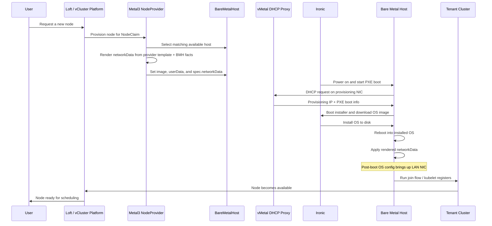

# Network Data Template Demo

This runbook documents the final `network-data-template-secret` model used by
this repo.

The important point is simple:

- provisioning still happens on `br-provision` / `172.22.0.0/24`
- the installed node OS only configures the LAN NIC post-boot
- the `NodeProvider` selects that behavior with
  `vcluster.com/network-data-template-secret:
  vcluster-platform/vmetal-dual-nic-network-template`

That is the mechanism this demo uses to ensure the running node joins and is
managed on its LAN address instead of the provisioning address.

## Final model

The working ownership split in this repo is:

- `BareMetalHost`
  - carries provisioning inputs:
    - `metal3.vcluster.com/ip-address`
    - `metal3.vcluster.com/gateway`
    - `metal3.vcluster.com/dns-servers`
  - carries a LAN identity hint:
    - `lan.vcluster.com/mac`
- `NodeProvider`
  - references a namespaced network template Secret
  - does not need `vcluster.com/user-data` for NIC selection
- `network-data-template-secret`
  - configures only the LAN NIC in the installed node OS



In other words:

- PXE, Ironic, and image delivery use the provisioning NIC
- the installed node only brings up the LAN NIC
- kubelet naturally registers `192.168.50.x`
- SSH to the running node also uses `192.168.50.x`

## Why this works

Earlier dual-NIC attempts configured both NICs in the installed OS. That left
Kubernetes with two possible node identities:

- provisioning IP on `172.22.0.x`
- LAN IP on `192.168.50.x`

That required fallback bootstrap logic to force kubelet onto the LAN address.

The current template avoids that entirely by configuring only the LAN NIC
post-boot. The provisioning NIC is still used during the Metal3 lifecycle, but
it is not the normal runtime identity of the provisioned node.

## NodeProvider property

This is the property that selects the behavior:

```yaml
properties:
  vcluster.com/os-image: ubuntu-noble-bootstrap
  vcluster.com/ssh-keys: admin-bastion-host
  vcluster.com/network-data-template-secret: vcluster-platform/vmetal-dual-nic-network-template
```

You can see that in:

- [manifests/platform/node-provider.yaml](../manifests/platform/node-provider.yaml)
- [manifests/platform/node-provider-customer-topology.yaml](../manifests/platform/node-provider-customer-topology.yaml)

## Where the Secret lives

The network-data template Secret is not created on the provisioned worker node
cluster and not on the Metal3 guest cluster. It must be deployed on the
vCluster Platform control plane cluster in the `vcluster-platform` namespace,
because that is where the `NodeProvider` resolves:

```yaml
vcluster.com/network-data-template-secret: vcluster-platform/vmetal-dual-nic-network-template
```

In this demo, the control plane cluster is the cluster where the `NodeProvider`
resource itself lives and where vCluster Platform reconciles node claims.

## Network template Secret

This repo’s working template lives at:

- [manifests/platform/network-data-template-secret.yaml](../manifests/platform/network-data-template-secret.yaml)

The important parts are:

```yaml
apiVersion: v1
kind: Secret
metadata:
  name: vmetal-dual-nic-network-template
  namespace: vcluster-platform
  labels:
    vcluster.com/user-data-template-type: network-data
type: Opaque
stringData:
  data: |
    {
      "links": [
        {
          "id": "lan-nic",
          "type": "phy",
          "ethernet_mac_address": "{{ index .Values.BareMetalHost "metadata" "annotations" "lan.vcluster.com/mac" }}"
        }
      ],
      "networks": [
        {
          "id": "lan-net",
          "link": "lan-nic",
          "type": "ipv4_dhcp"
        }
      ],
      "services": [
        {
          "type": "dns",
          "address": "192.168.50.1"
        }
      ]
    }
```

What this means:

- the template does not configure the provisioning NIC
- it selects the LAN NIC by matching `lan.vcluster.com/mac`
- it enables DHCP only on the LAN NIC
- it points the installed node at the LAN-side DNS server

## BareMetalHost side

The `BareMetalHost` no longer needs to carry a `metal3.vcluster.com/network-data`
annotation in this repo.

The relevant host-side inputs are:

```yaml
metadata:
  annotations:
    lan.vcluster.com/mac: 52:54:00:ac:00:03
    metal3.vcluster.com/ip-address: 172.22.0.14/24
    metal3.vcluster.com/gateway: 172.22.0.1
    metal3.vcluster.com/dns-servers: 172.22.0.1
```

Interpretation:

- provisioning annotations are still for the Metal3 provisioning path
- `lan.vcluster.com/mac` is the hint the template uses to pick the post-boot
  runtime NIC

## What to verify

To prove the template-only path is working, provision a fresh node and check
both the cluster view and the guest OS.

Cluster-side success looks like:

```bash
kubectl get nodes -o wide
```

Expected:

- `INTERNAL-IP` is `192.168.50.x`
- not `172.22.0.x`

Guest-side success looks like:

```bash
sudo ls /usr/local/bin/configure-vdemo-node-bootstrap
sudo ls /usr/local/bin/configure-vdemo-kubelet-node-ip
sudo ls /etc/systemd/system/vdemo-resolved-domain.service
sudo ls /etc/systemd/system/vdemo-kubelet-node-ip.service
sudo ls /etc/netplan/60-vmetal-dual-nic.yaml
sudo ls /etc/systemd/system/kubelet.service.d/20-vmetal-node-ip.conf
```

Expected:

- those fallback files do not exist

Operationally, SSH should also use the LAN IP:

```bash
ssh ubuntu@192.168.50.x
```

The provisioning IP should no longer be your normal management path once the
installed OS is running.

## Demo talk track

Use language like this:

> "Metal3 still provisions on the private bridge, but the running node OS only
> configures the LAN NIC. The `NodeProvider` picks a reusable network-data
> template Secret, and that template uses the BareMetalHost’s LAN MAC
> annotation to bind the correct interface after provisioning."

> "That means kubelet, SSH, NodePort, and LoadBalancer traffic all land on the
> LAN IP, while PXE and Ironic stay isolated on the provisioning network."

## Caveat

The public vCluster Platform docs clearly document:

- `metal3.vcluster.com/network-data`
- `vcluster.com/user-data-template-secret`
- the required Secret label `vcluster.com/user-data-template-type`

This repo uses the reusable `Network Data` template flow exposed in the
Platform UI under Bare Metal Servers -> User Data Templates. In manifest form,
that means:

- `vcluster.com/network-data-template-secret`

This demo references the template by its namespaced Secret name and uses it to
select the post-provisioning LAN NIC for the installed node OS.
